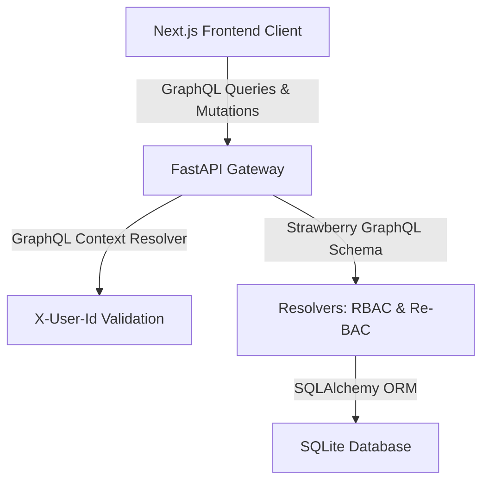

# Architecture, Design & API Documentation

This document describes the system architecture, database design, seeded datasets, and the GraphQL API collection for the Slooze Role-Based Food Ordering Application.

---

## 🏗️ System Architecture

The application is structured as a decoupled full-stack system:



### 1. Frontend: Next.js (App Router)
* **Apollo Client**: Handles GraphQL query caching and state. A custom middleware link (`providers.tsx`) reads the active session ID from `localStorage` and automatically attaches it to the `X-User-Id` header of every GraphQL request.
* **Tailwind CSS & Outfit Font**: Power a premium dark-themed dashboard.
* **Login Module**: Intercepts unauthenticated requests, presenting employee persona cards with local storage session persistence.

### 2. Backend: FastAPI & Strawberry GraphQL
* **FastAPI Router**: Serves the GraphQL endpoints at `/graphql` and mounts the GraphiQL playground.
* **Context Manager**: Dynamically initializes and yields a SQLAlchemy DB session per request and extracts user metadata from incoming headers.
* **Strawberry Schema**: Translates Python dataclasses to strict GraphQL types, queries, and mutations.

---

## 🗄️ Database Design & Seeded Dataset

We use **SQLite** as a self-contained local database file (`food_ordering.db`). The schema is defined in `backend/models.py`.

### 1. Tables and Relations
* `users`: `id` (PK), `name`, `role` (ADMIN, MANAGER, MEMBER), `country` (Global, India, America).
* `restaurants`: `id` (PK), `name`, `cuisine`, `country` (India, America), `image_url`.
* `menu_items`: `id` (PK), `restaurant_id` (FK), `name`, `price`, `currency`, `description`.
* `payment_methods`: `id` (PK), `country` (India, America), `method_type`, `details` (e.g. card masks, UPI IDs).
* `orders`: `id` (PK), `user_id` (FK), `country`, `status` (PENDING_PAYMENT, PAID, CANCELLED), `total_amount`, `currency`, `created_at`, `payment_method_id` (FK, nullable).
* `order_items`: `id` (PK), `order_id` (FK), `menu_item_id` (FK), `quantity`, `price`.

### 2. Seeded Dataset (Auto-inserted on first run)
* **Users**:
  1. `nick_fury` (Admin, Global)
  2. `captain_marvel` (Manager, India)
  3. `captain_america` (Manager, America)
  4. `thanos` (Member, India)
  5. `thor` (Member, India)
  6. `travis` (Member, America)
* **Restaurants**:
  * **India**: *Royal Biryani House* (Cuisine: Mughlai), *Delhi Chaat Corner* (Cuisine: Street Food)
  * **America**: *Burger Empire* (Cuisine: Burgers), *Liberty Pizza* (Cuisine: Pizza)
* **Payment Methods**:
  * **India**: UPI (`slooze-corporate@ybl`)
  * **America**: Corporate Card (`Visa (*4242)`)
* **Default Orders**:
  * Order #1 (Thanos - India, Status: PENDING_PAYMENT)
  * Order #2 (Travis - America, Status: PAID, paid using Visa)

---

## 🧬 GraphQL API Collection (Playground)

You can run these queries directly inside the GraphiQL Playground at http://localhost:8000/graphql. 

> [!NOTE]
> To simulate authentication, add the header `{"X-User-Id": "username_id"}` in the **Headers** tab at the bottom of the playground interface.

### 1. Queries

#### A. Fetch Current Active Session Details
* **Header**: `{"X-User-Id": "thanos"}`
```graphql
query GetMyProfile {
  me {
    id
    name
    role
    country
  }
}
```

#### B. Fetch Regional Restaurants (Re-BAC Filtered)
* *Note: If X-User-Id is `thanos`, only Indian restaurants return. If X-User-Id is `nick_fury`, all return.*
```graphql
query GetRestaurants {
  restaurants {
    id
    name
    cuisine
    country
    menuItems {
      id
      name
      price
      currency
    }
  }
}
```

#### C. Fetch Order History Ledger (Re-BAC Filtered)
```graphql
query GetOrders {
  orders {
    id
    status
    totalAmount
    currency
    createdAt
    user {
      name
      role
    }
    items {
      quantity
      price
      menuItem {
        name
      }
    }
    paymentMethod {
      methodType
      details
    }
  }
}
```

### 2. Mutations

#### A. Create Order (Add Items)
* **Header**: `{"X-User-Id": "thanos"}`
* **Variables**:
```json
{
  "country": "India",
  "items": [
    { "menuItemId": 1, "quantity": 2 },
    { "menuItemId": 3, "quantity": 1 }
  ]
}
```
* **Query**:
```graphql
mutation PlaceOrder($country: String!, $items: [OrderItemInput!]!) {
  createOrder(country: $country, items: $items) {
    id
    status
    totalAmount
    currency
  }
}
```

#### B. Checkout & Pay (RBAC: Admin & Manager Only)
* **Header**: `{"X-User-Id": "captain_marvel"}` (Succeeds) / `{"X-User-Id": "thanos"}` (Fails)
```graphql
mutation ApproveAndPay {
  payOrder(orderId: 1) {
    id
    status
    paymentMethod {
      methodType
      details
    }
  }
}
```

#### C. Cancel Order (RBAC: Admin & Manager Only)
```graphql
mutation CancelOrder {
  cancelOrder(orderId: 1) {
    id
    status
  }
}
```

#### D. Update Billing Channel (RBAC: Admin Only)
* **Header**: `{"X-User-Id": "nick_fury"}` (Succeeds) / `{"X-User-Id": "captain_marvel"}` (Fails)
```graphql
mutation UpdateBilling {
  updatePaymentMethod(id: 1, methodType: "Bank Transfer", details: "HDFC Acc (*8899)") {
    id
    methodType
    details
  }
}
```
